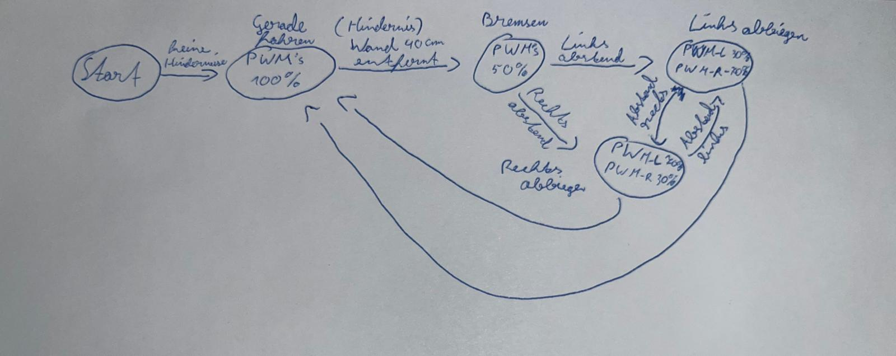

# Autonomiestrategie — Wall-Follower mit vornem IR-Sensor

## Ziel
Die Autonomiestrategie des Roboters basiert auf der Wall-Follower-Logik, bei der der Roboter der **rechten Wand** folgt. Hierbei wird nur der **vordere IR-Sensor** verwendet, um den Abstand zur Wand zu messen und den Roboter zu steuern. Der **Ultraschallsensor** wird zur **Hinderniserkennung** und zum **Ausweichen** eingesetzt.

---

## Navigationsstrategie

- **Primär**: **Wall-Follower mit vornem IR-Sensor**
  - Der Roboter folgt der **rechten Wand** unter Verwendung des **vorderen IR-Sensors** (10–80 cm).
  - Der Abstand zur Wand wird kontinuierlich gemessen, und die Richtung des Roboters wird entsprechend angepasst (falls der Abstand zu groß oder zu klein wird, erfolgt eine Korrektur).

- **Sekundär**: **Ultraschallsensor** wird genutzt, um Hindernisse zu erkennen und entsprechend auszuweichen.

---

## Zustandsautomat (Skizze)

| **Skizze** ||
---
## Schnittstellen & APIs

Für die Kommunikation zwischen den Komponenten werden folgende Schnittstellen definiert:

Motorsteuerung: Funktionen zum Steuern der Motoren, z. B. motorVorwaerts(), motorRueckwaerts(), motorStop().

Sensorabfrage: Funktionen zum Auslesen der Sensordaten, z. B. getAbstand(), getBodenSensor().

Navigation: Funktionen zur Berechnung der Fahrtrichtung, z. B. berechneKorrektur().

## Aktualisierungsraten

**Sensoren**: 10 Hz (alle 100 ms)

**Motorsteuerung**: 50 Hz (alle 20 ms)

## Filter

**Moving Average**: Glättung der Sensordaten zur Reduzierung von Rauschen.

**Debounce**: Vermeidung mehrfacher Auslösungen bei schnellen Änderungen.

## Schwellwerte (Startwerte)

- **Zielabstand zur Wand**: 15–20 cm.
- **Abbremsen**: Wenn IR_Sensor < 40 cm.
- **Ausweichen**: Wenn IR_Sensor < 25 cm.
- **Not-Stop**: Wenn IR_Sensor < 10 cm oder bei kritischen Fehlern.

---

## Pseudo Code

StarteFahrzeug()
    SetzeMotorenPWM(PWM_Fahrzeug)  // Setze beide Motoren auf PWM 100% (gerade Fahrt)

    Solange (Fahre):
        IR_Sensor_Abstand = MesseIR_Sensor()  // Lese den Wert des IR-Sensors (Abstand zum Hindernis)

        Wenn IR_Sensor_Abstand < 40 cm:  // Wenn ein Hindernis erkannt wird (z.B. bei weniger als 40 cm Abstand)
            Bremsen()
            SetzeMotorenPWM(PWM_Bremsen)  // Reduziere die Geschwindigkeit auf 50%

            // Überprüfe, ob der Roboter nach links oder rechts drehen soll
            Wenn (Abstand Links):
                DreheLinks()
            Sonst Wenn (Abstand Rechts):
                DreheRechts()
            Ende
        Ende

        // Wenn kein Hindernis, fahre weiter geradeaus
        SetzeMotorenPWM(PWM_Fahrzeug)  // Weiter mit PWM 100%
    Ende

Funktion DreheLinks()
    // Setze den linken Motor auf 70% PWM und den rechten auf 30% PWM (Drehung nach links)
    SetzeMotorenPWMLinks(PWM_Links)
    SetzeMotorenPWMRechts(PWM_Rechts)
Ende

Funktion DreheRechts()
    // Setze den linken Motor auf 30% PWM und den rechten auf 70% PWM (Drehung nach rechts)
    SetzeMotorenPWMLinks(PWM_Rechts)
    SetzeMotorenPWMRechts(PWM_Links)
Ende

Ende
