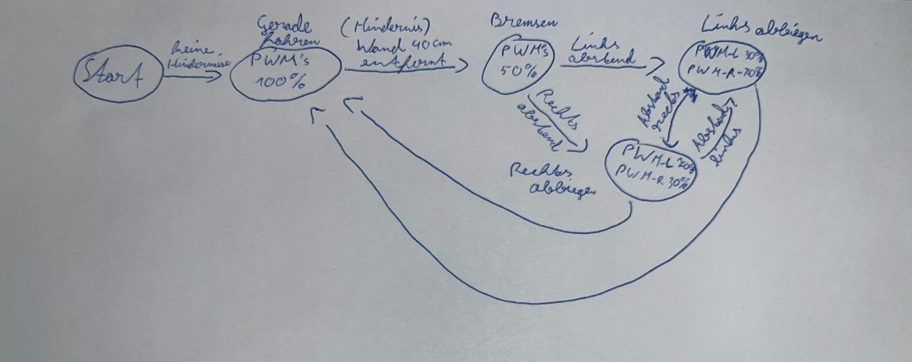

# Autonomiestrategie — Wall-Follower mit vornem IR-Sensor

## Ziel
Die Autonomiestrategie des Roboters basiert auf der Wall-Follower-Logik, bei der der Roboter der **rechten Wand** folgt. Hierbei wird nur der **vordere IR-Sensor** verwendet, um den Abstand zur Wand zu messen und den Roboter zu steuern. Der **Ultraschallsensor** wird zur **Hinderniserkennung** und zum **Ausweichen** eingesetzt.

---

## Navigationsstrategie

- **Primär**: **Wall-Follower mit vornem IR-Sensor**
  - Der Roboter folgt der **rechten Wand** unter Verwendung des **vorderen IR-Sensors** (10–80 cm).
  - Der Abstand zur Wand wird kontinuierlich gemessen, und die Richtung des Roboters wird entsprechend angepasst (falls der Abstand zu groß oder zu klein wird, erfolgt eine Korrektur).

- **Sekundär**: **Ultraschallsensor** wird genutzt, um Hindernisse zu erkennen und entsprechend auszuweichen.

---

## Zustandsautomat (Skizze)


| **Skizze** ||
---

## Schwellwerte (Startwerte)

- **Zielabstand zur Wand**: 15–20 cm.
- **Abbremsen**: Wenn Ultraschall < 40 cm.
- **Ausweichen**: Wenn Ultraschall < 25 cm.
- **Not-Stop**: Wenn Ultraschall < 10 cm oder bei kritischen Fehlern.

---

## Pseudo Code

```cpp

loop() {
    readSensors();  // Liest den vorderen IR-Sensor und den Ultraschallsensor.

    switch(state) {
        case IDLE:
            stopMotors();
            if (startButton) state = WALLFOLLOWER;  // Startsignal.
            break;

        case WALLFOLLOWER:
            error = targetDist - irFront;  // Differenz zum Sollabstand
            adjustMotorsPID(error);  // PID-Regelung zur Wandverfolgung
            if (ultraFront < 40) state = ANNAEHERUNG;  // Wenn Hindernis erkannt.
            break;

        case ANNAEHERUNG:
            slowDown();  // Geschwindigkeit verringern.
            if (ultraFront < 25) state = AUSWEICHEN;  // Hindernis näher als 25 cm.
            else if (ultraFront > 45) state = WALLFOLLOWER;  // Weiterfahrt, wenn freier Weg.
            break;

        case AUSWEICHEN:
            scanWithServo();  // Servo scannt nach freien Richtungen.
            chooseFreeDirection();  // Entscheidet, ob nach links oder rechts ausgewichen wird.
            turnRobot();  // Roboter dreht sich in die gewählte Richtung.
            state = RUECKKEHR;
            break;

        case RUECKKEHR:
            moveUntilWallDetected();  // Fährt zurück zur Wand.
            state = WALLFOLLOWER;  // Zurück zur Wall-Follower-Logik.
            break;

        case ZIEL:
            stopMotors();  // Stoppen, Ziel erreicht.
            break;

        case FAILSAFE:
            emergencyStop();  // Stoppt sofort bei Fehler.
            break;
    }
}